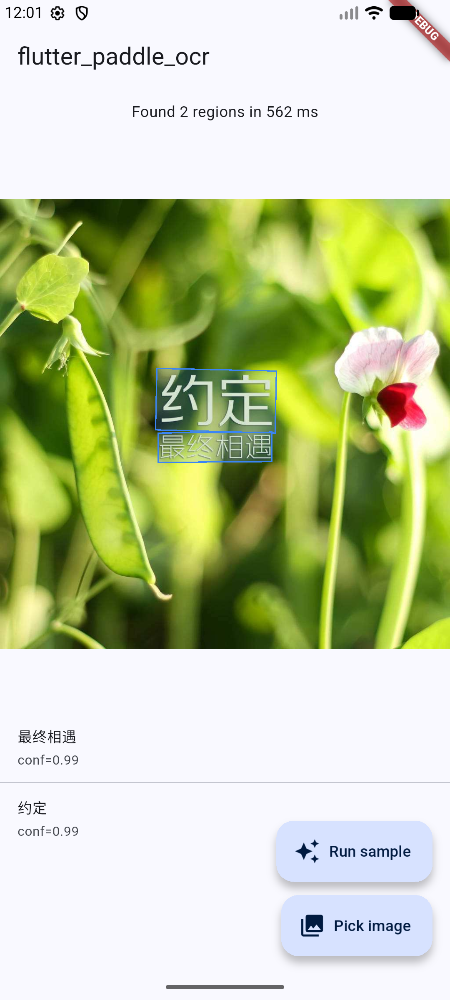

# flutter_paddle_ocr

On-device OCR for Flutter, powered by [PaddleOCR](https://github.com/PaddlePaddle/PaddleOCR) +
[Paddle Lite](https://github.com/PaddlePaddle/Paddle-Lite). Wraps the official PaddleOCR Android
demo's native C++/JNI pipeline (detection → angle classification → recognition) behind a simple
Dart API.

<p align="center">
  
</p>

---

## Features

- Text **detection** (DB algorithm) + **recognition** (CRNN) + optional **angle classification**
- Runs fully **on-device** — no network calls after first model download
- Supports **PP-OCRv2 / PP-OCRv3 slim** mobile models (Chinese, English, and others by swapping the
  dictionary file)
- Multi-instance safe — create one `PaddleOcr` per model set, dispose when done
- Native pipeline reused verbatim from PaddleOCR's `deploy/android_demo/` — ~20 C++ files plus the
  `OCRPredictorNative` JNI wrapper

## Status

| Platform | Status |
| --- | --- |
| Android (arm64-v8a) | ✅ Supported |
| Android (armeabi-v7a) | ❌ Paddle Lite v2.10 prebuilts don't ship 32-bit libs |
| iOS | 🚧 Stub — tracks [Paddle-Lite-Demo/ocr/ios/ppocr_demo](https://github.com/PaddlePaddle/Paddle-Lite-Demo/tree/develop/ocr/ios/ppocr_demo) |

## Compatibility matrix

| Plugin | Paddle Lite runtime | Models known to work |
| --- | --- | --- |
| `0.0.x` | `v2.10` (Feb 2022) | PP-OCRv2 slim, PP-OCRv3 slim |

PP-OCRv5 mobile `.nb` files are not yet published upstream. When they are, bump `paddleLiteVersion`
(see [Upgrading Paddle Lite](#upgrading-paddle-lite) below).

## Installation

```yaml
dependencies:
  flutter_paddle_ocr:
    git:
      url: https://github.com/phanbaohuy96/flutter-paddle-ocr
```

### Android setup

Because Paddle Lite v2.10 predates NDK r27's stricter linker, this plugin pins **NDK r25c**
(`25.2.9519653`). Install it via Android Studio's SDK Manager or:

```
sdkmanager --install "ndk;25.2.9519653"
```

The plugin's `android/build.gradle` fetches these archives automatically on first build:

- `paddle_lite_libs_v2_10.tar.gz` (~75 MB) — native `libpaddle_light_api_shared.so`
- `opencv-4.2.0-android-sdk.tar.gz` (~150 MB) — OpenCV static libs

They're cached in `android/cache/` by MD5, so repeat builds are offline.

### iOS

Not implemented yet. Every method call returns a `PlatformException(UNIMPLEMENTED)` until the
iOS port lands.

## Usage

```dart
import 'dart:typed_data';
import 'package:flutter_paddle_ocr/flutter_paddle_ocr.dart';

// 1. Put the models on-device first. Paths must be absolute.
//    Typical pattern: download PP-OCRv2 tarball at first launch, extract into
//    the app's documents directory. See example/lib/main.dart for a full recipe.
final ocr = await PaddleOcr.create(
  detModelPath: '/path/to/det_db.nb',
  recModelPath: '/path/to/rec_crnn.nb',
  clsModelPath: '/path/to/cls.nb',          // optional — omit to skip angle classification
  labelPath: '/path/to/ppocr_keys_v1.txt',  // character dictionary
);

// 2. Run OCR on an image (PNG/JPEG/BMP/WebP bytes).
final Uint8List bytes = ...;
final results = await ocr.recognize(bytes, runClassification: true);
for (final r in results) {
  print('${r.text}  (${r.confidence.toStringAsFixed(2)})  ${r.points}');
}

// 3. Release native resources.
await ocr.dispose();
```

### Getting the models

Download URLs (from PaddleOCR's `deploy/android_demo/app/build.gradle`):

- **PP-OCRv2 bundle** — https://paddleocr.bj.bcebos.com/PP-OCRv2/lite/ch_PP-OCRv2.tar.gz
  (contains `det_db.nb`, `rec_crnn.nb`, `cls.nb`)
- **Chinese dictionary** — https://paddleocr.bj.bcebos.com/dygraph_v2.0/lite/ch_dict.tar.gz
  (contains `ppocr_keys_v1.txt`)

For English / other languages, see [PaddleOCR's model list](https://github.com/PaddlePaddle/PaddleOCR/blob/main/doc/doc_en/models_list_en.md)
and pair the matching dictionary from [`ppocr/utils/`](https://github.com/PaddlePaddle/PaddleOCR/tree/main/ppocr/utils).

The example app downloads + extracts these tarballs at first launch using
`http` + `archive`:
[`example/lib/main.dart`](example/lib/main.dart).

## Example

```
cd example
flutter run
```

The demo app ships a sample image so you can verify OCR works without needing to pick from the
gallery. First launch downloads ~5 MB of models.

## Upgrading Paddle Lite

Paddle Lite moves slowly and v2.10 is the last version that matches PaddleOCR's shipped mobile
demo, so most users won't need to touch this. But if/when you do:

1. Set the version in `android/gradle.properties` of your app (or pass `-PpaddleLiteVersion=v2_12`):
   ```
   paddleLiteVersion=v2_12
   ```
2. Delete `<plugin>/android/PaddleLite/` and `<plugin>/android/cache/` to force a re-download.
3. Rebuild. If the C++ code no longer compiles, patch `ppredictor.cpp` /
   `predictor_input.cpp` / `predictor_output.cpp` — they're thin wrappers around
   `paddle::lite_api::MobileConfig` and the delta between versions is usually a handful of lines.
4. Re-optimize your `.nb` models with the new `opt` tool if the naive-buffer format changed.

## How it works

```
 Dart (PaddleOcr.recognize)
   ↓ MethodChannel
 Kotlin (FlutterPaddleOcrPlugin)
   ↓ BitmapFactory.decodeByteArray
 Java (OCRPredictorNative#runImage)         ← reused verbatim from PaddleOCR android_demo
   ↓ JNI
 C++ (native.cpp / ocr_ppredictor.cpp)      ← reused verbatim from PaddleOCR android_demo
   ↓ Paddle Lite
 .nb models (detection → optional classification → recognition)
```

The native sources under `android/src/main/cpp/` and `android/src/main/java/com/baidu/paddle/lite/demo/ocr/`
are copied from
[`PaddleOCR/deploy/android_demo/`](https://github.com/PaddlePaddle/PaddleOCR/tree/main/deploy/android_demo)
with zero code changes — the plugin is purely a MethodChannel + dictionary-postprocess wrapper.

## License

This plugin, along with the reused PaddleOCR sources, is distributed under the
[Apache License 2.0](LICENSE).
